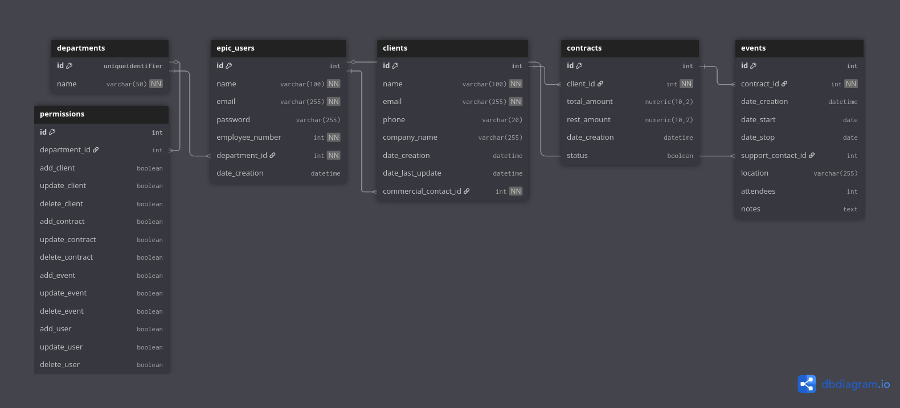

# Epic Event CRM

## Introduction

Epic Event is a consulting and event management company that caters to the needs of start-ups looking to organize epic parties.

This software is a CRM (Customer Relationship Management) for internal use, design to manage users, clients, contracts and events, and to be used as a CLI (Command Line Interface).

There are three teams, commercial, support and management. Each team has specific rights within the application.

## Getting started

- Python version 3.10.12

### Packages used

- sqlalchemy
- pymysql
- dotenv
- pyjwt
- argon2-cffi
- rich
- sentry-sdk[sqlaclhemy]
- pytest
- pytest-sqlalchemy-mock
- pytest-cov
- flake8
- flake8-html

### Virtual environment

#### Creation

Create the environment with poetry.

```
cd OC-P12/
poetry install --no-root
```

#### Activation

Activate the virtual environment.

For windows
```
.venv/Scripts/activate
```

For Unix/macOs

```
source .venv/bin/activate
```

### Database

You need to create a mysql database and put the parameters in the .env file

Diagram : [](https://dbdiagram.io/d/Epic-Event-686664bbf413ba35081cee03)

### Env variables

Create a file name '.env' to set environnement variables for the application with the following parameters :

The database user must have the right to create tables.

- For the database :
    - DB_USER : login
    - DB_PASSWORD : password
    - DB_HOST : address (ex: localhost)
    - DB_PORT : port (default: 3306)
    - DB_NAME : Name of the database created

- For the encryption :
    - TIME_COST
    - MEMORY_COST
    - PARALLELISM
    - HASH_LEN
    - SALT_LEN

Please visit the [argon2 documentation](https://argon2-cffi.readthedocs.io/en/stable/api.html#argon2.PasswordHasher) for the encryption parameters

## Application Description

launch the script and choose what you want to do.

```
python main.py

or

python3 main.py
```

### First launch

On first launch, the application asks the informations to create a management user to create future user.

If a user is created, the application will generate the encryption key for the password.

### Login

Your e-mail is ask.

If it's your first time ,the application will ask you to create your password.

The password is then requested for login.

### Main menu

After login, the application shows the main menu and wait for a command.

Check the 'permission' section to know the possible commands or what is displayed.

Possible reactions when a command is entered:

- You have the permission to do the command, following what application's instructions.

- You have the permission but it's not possible to do it, examples :
    - A management user tries to add a contract but there is no client
    - A commercial user tries to update an event but there is no event for one of there clients

    The application will tells you that is not possible at the time.

- You don't have the permission, a message appears.

- The command is unknown, a message appears.

### Permission

||Commercial|Support|Management|
|-|:-:|:-:|:-:|
|Add user|||X|
|Update user|||X|
|Delete user|||X|
|Add client|X|||
|Update client|X|||
|Delete client|X|||
|Add contract|||X|
|Update contract|X||X|
|Delete contract|X||X|
|Add event|X|||
|Update event||X|*|
|Delete event|X|X||

\* : On event, the management team can only update the support contact

Everyone can view users, clients, contracts or events.

Few filters can be add with view command, they are describe in the application.

## Coverage test

If you want to check test coverage, type the following command :

```
pytest --cov=. --cov-report html

```

All test will be executed and a html report will be generated in the folder 'htmlcov'

## Check the code

Use flake8 to check if the project follow pep-8 guide for python code.

```
flake8 --format=html --htmldir=flake8-html
```

It will create a HTML file with the result in the folder "flake8-html".